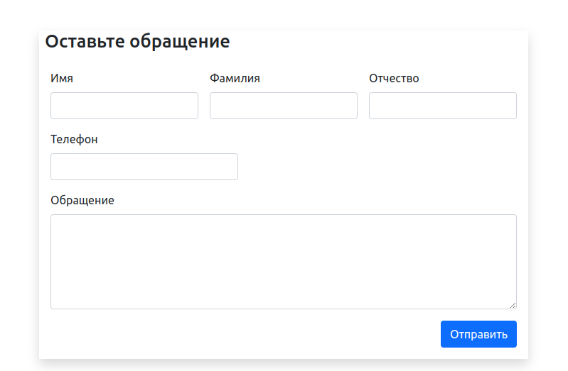

# Микросервис FRONTEND -> BACKEND(Tornado) -> RabbitMQ -> SERVICEDB(FastAPI) -> PostgreSQL
    В данном проекте испрользуется форма для регистрации обращений с последующей трансаляцией
    полученных данных от пользователя в BACKEND(Tornado), отпрвка сообщений в брокер RabbitMQ, 
    получение сообщении в SERVICEDB(FastAPI) и их запись в базу данных PostgreSQL.
      

## Установка и запуск (Docker)

1. Скачайте код проекта с GitHub:
```sh
   git clone https://github.com/RuslanKap/reg_pro.git
```
2. Перейдите в корневую директорию проекта:
```sh
   cd reg_pro/
```
3. Для запуска проекта в терминале выполните команду:
```sh
   docker-compose up -d
```
4. После запуска всех контейнеров, в браузере перейдите по адресу:
```sh
   http://127.0.0.1/
```

